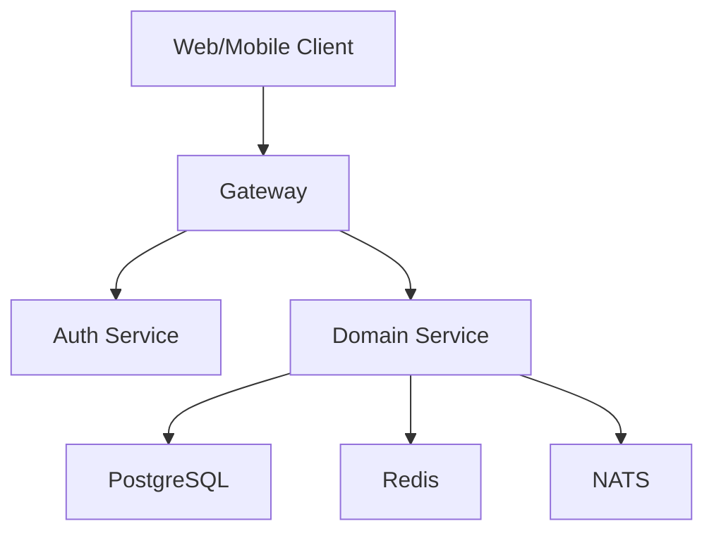

# Architecture Overview

HQuizlet Platform is designed as a gradual migration from the existing
Next.js/tRPC monorepo into explicit backend services and independent frontend
apps.

## Service Boundaries

| Service | Owns | First endpoints |
| --- | --- | --- |
| Gateway | Routing, request IDs, auth forwarding | `/healthz`, `/v1/*` |
| Auth | Users, OAuth accounts, sessions, roles | `/healthz`, `/v1/auth/me` |
| Study | Study sets, flashcards, folders | `/healthz`, `/v1/study-sets` |
| Quiz | Quiz attempts, live sessions, scoring | `/healthz`, `/v1/live-sessions` |
| Payment | Orders, wallet, entitlements, webhooks | `/healthz`, `/v1/payments` |
| File | R2/S3 uploads, avatars, metadata | `/healthz`, `/v1/files` |

## Request Flow

## Auth Direction

The old system uses NextAuth database sessions. During migration, the first Go
auth service should support validating the old opaque session token, then move
to short-lived access tokens plus refresh tokens.

## Data Ownership

Start with one PostgreSQL instance for local development. Keep schemas separated
by service ownership. Avoid cross-service writes; use events for asynchronous
side effects.

