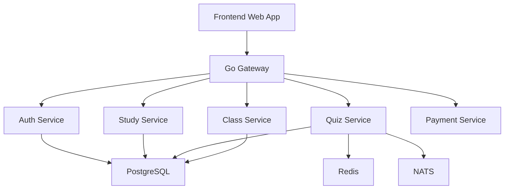

# HQuizlet Go/Rust Migration Roadmap

## Muc Tieu

Viet lai HQuizlet theo huong frontend va backend tach biet, backend chay bang
Go microservices, cac phan can tinh toan/logic hieu nang cao co the tach sang
Rust crate. Qua trinh migration se lam tung buoc, uu tien chay duoc va de bao
tri truoc, sau do moi toi uu sau.

## Nguyen Tac Thiet Ke

1. Frontend chi noi chuyen voi Gateway.
2. Moi service so huu domain va schema cua minh.
3. PostgreSQL la database chinh cho du lieu ben vung.
4. Redis dung cho cache, realtime state, live quiz state.
5. NATS dung cho event bat dong bo giua services.
6. OpenAPI la hop dong API giua frontend va backend.
7. Code Go chia ro handler, service, repository, model.
8. Rust chi dung cho logic co loi ich ro rang, khong dua vao qua som.
9. Migration theo tung module, khong rewrite tat ca cung luc.

## Kien Truc Dich



## Mapping Tu Repo Cu Sang Repo Moi

| Repo cu | Repo moi | Vai tro |
| --- | --- | --- |
| `apps/nextjs` | `apps/web` | Frontend web rieng |
| `apps/expo` | `apps/mobile` sau nay | Mobile app |
| `packages/auth` | `services/auth` | User, login, session, OAuth |
| `packages/api/src/router/studySet.ts` | `services/study` | Study set CRUD |
| `packages/api/src/router/flashcard.ts` | `services/study` | Flashcard CRUD |
| `packages/api/src/router/folder.ts` | `services/study` hoac `services/folder` | Folder |
| `packages/api/src/router/quiz.ts` | `services/quiz` | Quiz, test, learn logic |
| `packages/api/src/router/live.ts` | `services/quiz` | Live quiz |
| `packages/api/src/router/class.ts` | `services/class` | Class, member |
| `packages/api/src/router/payment.ts` | `services/payment` | Payment, wallet |
| `packages/db/src/schema` | SQL migrations | PostgreSQL schema |
| `packages/ui` | `apps/web/src/components` | UI components |

## Phase 0: Nen Tang Repo

### Muc tieu

Lam repo moi chay on dinh bang Docker, co frontend, gateway, services va
PostgreSQL.

### Viec can lam

1. Chuan hoa Docker Compose cho dev.
2. Chuan hoa health check moi service.
3. Gateway expose:
   - `GET /healthz`
   - `GET /healthz/services`
4. Frontend hien thi trang login/register co backend status.
5. PostgreSQL chay trong Docker va duoc auth/study service ket noi.
6. Them `.dockerignore`.

### Tieu chi hoan thanh

- `docker compose up --build` chay duoc toan bo stack.
- `http://localhost:5173` mo duoc frontend.
- `http://localhost:8080/healthz/services` tra ve status cac service.

## Phase 1: Chuan Hoa Backend Go

### Muc tieu

Bien cac service Go tu file `main.go` don gian thanh cau truc de mo rong.

### Cau truc de xuat

```text
services/auth/
  cmd/server/main.go
  internal/config/
  internal/http/
  internal/model/
  internal/repository/
  internal/service/
  internal/store/
  migrations/
```

### Viec can lam

1. Tach config doc tu env.
2. Tach DB connection thanh package rieng.
3. Tach JSON response/error helper.
4. Tach handler khoi business logic.
5. Tach SQL repository.
6. Them migration runner.
7. Them logging middleware.
8. Them request ID middleware.

### Tieu chi hoan thanh

- Handler khong viet SQL truc tiep.
- Service logic khong phu thuoc HTTP.
- Repository la noi duy nhat query DB.

## Phase 2: Auth Thuc Su

### Muc tieu

Co dang ky, dang nhap, dang xuat, lay current user that.

### Schema

| Table | Cot chinh |
| --- | --- |
| `users` | `id`, `name`, `email`, `password_hash`, `image`, `role`, `created_at` |
| `sessions` | `id`, `user_id`, `token_hash`, `expires_at`, `created_at` |
| `accounts` | OAuth account neu can migrate Google/GitHub |

### API

| Method | Route | Muc dich |
| --- | --- | --- |
| `POST` | `/v1/auth/register` | Tao user |
| `POST` | `/v1/auth/login` | Dang nhap |
| `POST` | `/v1/auth/logout` | Dang xuat |
| `GET` | `/v1/auth/me` | Lay user hien tai |
| `POST` | `/v1/auth/refresh` | Refresh session/token |

### Frontend

1. Login/register form.
2. Luu session bang httpOnly cookie hoac access token tuy chon sau.
3. Protected route/layout.
4. User menu.
5. Logout button.

### Tieu chi hoan thanh

- Dang ky user luu DB.
- Dang nhap tra session/token.
- Refresh trang van giu login.
- Logout xoa session.

## Phase 3: Study Set Va Flashcard Core

### Muc tieu

Lam module chinh cua Quizlet clone: tao bo the, sua bo the, them flashcard,
xem danh sach va chi tiet.

### Schema

| Table | Muc dich |
| --- | --- |
| `study_sets` | Bo the hoc |
| `flashcards` | The trong study set |
| `starred_flashcards` | The da danh dau |

### API

| Method | Route | Muc dich |
| --- | --- | --- |
| `GET` | `/v1/study-sets` | List study sets |
| `POST` | `/v1/study-sets` | Tao study set |
| `GET` | `/v1/study-sets/{id}` | Chi tiet study set |
| `PUT` | `/v1/study-sets/{id}` | Sua study set |
| `DELETE` | `/v1/study-sets/{id}` | Xoa study set |
| `POST` | `/v1/study-sets/{id}/flashcards` | Them flashcard |
| `PUT` | `/v1/flashcards/{id}` | Sua flashcard |
| `DELETE` | `/v1/flashcards/{id}` | Xoa flashcard |
| `POST` | `/v1/flashcards/{id}/star` | Star/unstar |

### UI

1. Dashboard sau dang nhap.
2. Study set list.
3. Create study set page.
4. Edit study set page.
5. Study set detail page.
6. Flashcard editor.
7. Empty/loading/error states.

### Tieu chi hoan thanh

- Tao study set tu UI.
- Them/sua/xoa flashcard tu UI.
- Reload trang du lieu van con trong PostgreSQL.

## Phase 4: Learning Modes

### Muc tieu

Xay dung cac che do hoc tu repo cu.

### Modes

| Mode | Xu ly chinh |
| --- | --- |
| Flashcards | Lat the, next/prev, shuffle |
| Learn | Cau hoi lap lai dua tren tien do |
| Match | Noi cap term/definition |
| Test | Sinh de test tu flashcards |

### Rust Candidate

Day la phase bat dau hop ly de dung Rust:

1. Shuffle deterministic.
2. Generate test questions.
3. Score answer.
4. Match pair validation.
5. Import/parser logic.

### Tieu chi hoan thanh

- Moi mode chay tren data that.
- Ket qua hoc co the luu vao DB.
- Logic co test rieng.

## Phase 5: Folder

### Muc tieu

To chuc study sets vao folders nhu repo cu.

### Schema

| Table | Muc dich |
| --- | --- |
| `folders` | Folder cua user |
| `folder_to_study_sets` | Lien ket folder va study set |

### API

| Method | Route | Muc dich |
| --- | --- | --- |
| `GET` | `/v1/folders` | List folders |
| `POST` | `/v1/folders` | Tao folder |
| `GET` | `/v1/folders/{id}` | Chi tiet folder |
| `PUT` | `/v1/folders/{id}` | Sua folder |
| `DELETE` | `/v1/folders/{id}` | Xoa folder |
| `POST` | `/v1/folders/{id}/study-sets` | Them set vao folder |
| `DELETE` | `/v1/folders/{id}/study-sets/{setId}` | Go set khoi folder |

### UI

1. Folder list.
2. Folder detail.
3. Add study set to folder.
4. Remove study set from folder.

## Phase 6: Live Quiz

### Muc tieu

Lam live quiz nhu repo cu, co host, join code, participant va leaderboard.

### Schema

| Table | Muc dich |
| --- | --- |
| `live_sessions` | Phien quiz |
| `live_session_participants` | Nguoi tham gia |
| `live_session_answers` | Cau tra loi |

### Redis

Dung Redis cho:

1. Session state dang live.
2. Participant online.
3. Current question index.
4. Leaderboard tam thoi.

### NATS Events

| Event | Khi nao publish |
| --- | --- |
| `live.session.created` | Tao session |
| `live.participant.joined` | Nguoi choi vao |
| `live.answer.submitted` | Nop cau tra loi |
| `live.session.ended` | Ket thuc |

### API

| Method | Route | Muc dich |
| --- | --- | --- |
| `POST` | `/v1/live-sessions` | Tao live session |
| `POST` | `/v1/live-sessions/{code}/join` | Join |
| `POST` | `/v1/live-sessions/{id}/answers` | Submit answer |
| `GET` | `/v1/live-sessions/{id}/leaderboard` | Leaderboard |

### UI

1. Host live quiz page.
2. Join by code page.
3. Player answer screen.
4. Leaderboard screen.

## Phase 7: Class Va User Activity

### Muc tieu

Ho tro lop hoc, member, class study sets, activity nhu repo cu.

### API

| Method | Route | Muc dich |
| --- | --- | --- |
| `GET` | `/v1/classes` | List class |
| `POST` | `/v1/classes` | Tao class |
| `GET` | `/v1/classes/{id}` | Chi tiet class |
| `POST` | `/v1/classes/{id}/members` | Them member |
| `POST` | `/v1/classes/{id}/study-sets` | Gan study set |
| `GET` | `/v1/activity` | Activity gan day |

### UI

1. Class list.
2. Class detail.
3. Member management.
4. Activity feed.

## Phase 8: Payment, Wallet, Entitlement

### Muc tieu

Port cac logic payment/wallet/entitlement sau khi core learning da on.

### Ly do de sau

1. Phu thuoc luong auth on dinh.
2. Can domain study set on dinh.
3. De gay side effect tai chinh neu thiet ke voi.

### API

| Method | Route | Muc dich |
| --- | --- | --- |
| `GET` | `/v1/wallet` | Lay wallet |
| `GET` | `/v1/payments/orders` | List order |
| `POST` | `/v1/payments/orders` | Tao order |
| `POST` | `/v1/payments/webhooks` | Webhook payment |

## Phase 9: File Upload

### Muc tieu

Ho tro avatar, image, attachment bang S3/MinIO/R2.

### API

| Method | Route | Muc dich |
| --- | --- | --- |
| `POST` | `/v1/files/presign` | Tao presigned upload URL |
| `GET` | `/v1/files/{id}` | Lay metadata |
| `DELETE` | `/v1/files/{id}` | Xoa file |

## Quality Checklist

Moi phase chi duoc xem la xong khi dat cac dieu kien:

1. API co request/response ro rang.
2. Loi tra ve format thong nhat.
3. PostgreSQL migration co the chay lai an toan.
4. Frontend co loading/error/empty states.
5. Docker Compose chay duoc tu repo root.
6. Code khong de SQL trong handler.
7. Logic quan trong co unit test.
8. README/docs duoc cap nhat.

## Thu Tu Lam Ngay Sau Hien Tai

1. Refactor `services/auth` va `services/study` sang clean architecture.
2. Them migration SQL rieng thay cho auto migrate trong `main.go`.
3. Lam login that:
   - hash password
   - verify password
   - create session/token
   - `GET /v1/auth/me` doc user that
4. Lam dashboard sau dang nhap.
5. Lam CRUD study set.
6. Lam CRUD flashcard.
7. Lam flashcard mode.
8. Lam learn/test/match.
9. Lam folder.
10. Lam live quiz.

## Ghi Chu Ve Hieu Nang

Dung Go cho API va I/O la hop ly vi:

1. Startup nhanh.
2. Binary gon.
3. Concurrency tot cho gateway/service.
4. De deploy container.

Dung Rust cho logic tinh toan la hop ly khi:

1. Can generate quiz/test nhanh.
2. Can parser/import file lon.
3. Can scoring deterministic va test ky.
4. Can xu ly live quiz state voi logic phuc tap.

Khong nen dua Rust vao CRUD qua som, vi se lam tang do phuc tap ma loi ich
chua ro.
