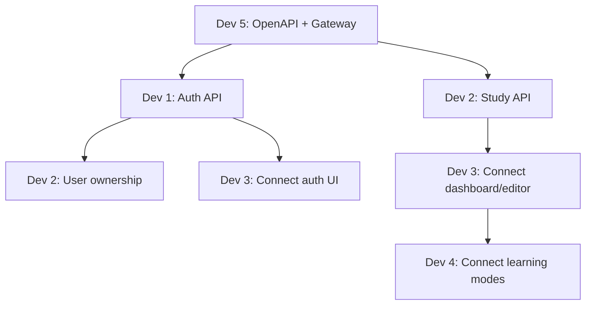

# HQuizlet Platform - Sprint 1 Dev Dependencies

## Muc Dich

File nay giup 5 dev biet:

1. Viec nao co the lam doc lap ngay.
2. Viec nao phai cho dev khac.
3. Khi bi cho thi chuyen sang task nao de khong bi dung viec.
4. Ai la nguoi can hoi khi bi block.

## Tong Quan Phu Thuoc

| Dev | Role | Co the lam ngay | Co the bi block boi | Khi bi block thi lam gi |
| --- | --- | --- | --- | --- |
| Dev 1 | Backend Go Auth | Refactor auth, migration users/sessions, register/login | Dev 5 neu OpenAPI auth thay doi | Viet unit/API test, chuan hoa error, docs auth |
| Dev 2 | Backend Go Study | Refactor study, migration study_sets/flashcards, CRUD basic | Dev 1 ve auth middleware/token; Dev 5 ve OpenAPI | Lam CRUD chua gan auth, repository test, seed data |
| Dev 3 | Frontend React Core | Auth UI, dashboard UI, create/edit study set UI bang mock | Dev 1/2 API that; Dev 5 API client/OpenAPI | Hoan thien responsive, validation, loading/error states |
| Dev 4 | Frontend React Learning | Flashcards/Learn/Test/Match UI bang mock | Dev 3 study detail page; Dev 5 data contract | Lam mock engine, UI state, responsive, component tests |
| Dev 5 | Fullstack/Integration | OpenAPI, gateway, Docker, API client, docs | Can input tu Dev 1/2 ve route/schema | Lam README, integration checklist, CORS, healthcheck |

## Nguyen Tac Khi Bi Block

1. Khong dung viec qua 30 phut.
2. Neu can doi API/schema, tao comment vao PR hoac bao trong daily sync.
3. Dung mock/interface tam thoi neu backend chua xong.
4. Dung contract OpenAPI lam nguon su that, khong tu doan response shape.
5. Neu task bi block, chuyen sang task fallback trong bang ben duoi.
6. Khong sua file cua dev khac neu chua thong nhat.

## Dependency Map

## Dev 1 - Backend Go Auth

### Lam Ngay Khong Can Cho

| Task | Mo ta | Output |
| --- | --- | --- |
| BE-AUTH-01 | Refactor auth service sang `cmd/internal` | Code auth tach handler/service/repository |
| BE-AUTH-02 | Tach config env | `PORT`, `DATABASE_URL`, `SESSION_TTL` doc tap trung |
| BE-AUTH-03 | Migration auth | SQL tao/sua `users`, `sessions` an toan |
| BE-AUTH-04 | Register/login service | Tao user, hash password, login tra token |
| BE-AUTH-06 | JSON error/response helper | Format loi thong nhat |

### Can Cho / Can Dong Bo

| Task | Cho ai | Ly do |
| --- | --- | --- |
| BE-AUTH-05 | Dev 5 | Can OpenAPI chot header/token format |
| Token verifier shared spec | Dev 2 + Dev 5 | Study service can doc user tu token |

### Neu Bi Block Thi Lam

| Fallback task | Mo ta |
| --- | --- |
| AUTH-FB-01 | Viet test case register/login/logout/me bang curl/Postman note |
| AUTH-FB-02 | Viet README auth env va response mau |
| AUTH-FB-03 | Chuan hoa message loi validation |
| AUTH-FB-04 | Kiem tra migration chay lai nhieu lan khong loi |

## Dev 2 - Backend Go Study

### Lam Ngay Khong Can Cho

| Task | Mo ta | Output |
| --- | --- | --- |
| BE-STUDY-01 | Refactor study service sang `cmd/internal` | Code tach handler/service/repository/model |
| BE-STUDY-02 | Migration study | SQL tao `study_sets`, `flashcards`, index |
| BE-STUDY-04 | CRUD study set basic | List/detail/create/update/delete chua can auth |
| BE-STUDY-05 | CRUD flashcard basic | Create/update/delete/list theo study set |
| BE-STUDY-06 | Star/unstar flashcard | Toggle starred |

### Can Cho / Can Dong Bo

| Task | Cho ai | Ly do |
| --- | --- | --- |
| BE-STUDY-03 | Dev 1 | Can auth middleware/token verifier de lay user |
| BE-STUDY-07 | Dev 1 | Can user identity de check owner permission |
| API response shape | Dev 5 | Can OpenAPI de frontend dung dung field |

### Neu Bi Block Thi Lam

| Fallback task | Mo ta |
| --- | --- |
| STUDY-FB-01 | Viet repository query va validate SQL rieng |
| STUDY-FB-02 | Them seed data dev cho study_sets/flashcards |
| STUDY-FB-03 | Viet docs request/response tam thoi cho Dev 3/4 |
| STUDY-FB-04 | Chuan hoa validation title/term/definition |
| STUDY-FB-05 | Chuan bi endpoint bulk flashcard cho sprint sau |

## Dev 3 - Frontend React Core

### Lam Ngay Khong Can Cho

| Task | Mo ta | Output |
| --- | --- | --- |
| FE-CORE-01 | Tach frontend theo feature folder | `features/auth`, `features/dashboard`, `features/study-sets` |
| FE-CORE-03 | Login/register UI bang mock | Form co loading/error |
| FE-CORE-04 | Protected layout local state | Chua login thi ve auth screen |
| FE-CORE-05 | Dashboard study set bang mock | List, empty state, reload state |
| FE-CORE-06 | Create/edit study set page bang mock | Nhap title/description/nhieu cards |

### Can Cho / Can Dong Bo

| Task | Cho ai | Ly do |
| --- | --- | --- |
| FE-CORE-02 | Dev 5 | Can API client wrapper va base response format |
| FE-CORE-07 auth | Dev 1 | Can login/register/me API that |
| FE-CORE-07 study | Dev 2 | Can study set/flashcard API that |

### Neu Bi Block Thi Lam

| Fallback task | Mo ta |
| --- | --- |
| CORE-FB-01 | Hoan thien responsive dashboard/editor |
| CORE-FB-02 | Them form validation UI |
| CORE-FB-03 | Them loading skeleton va error alert |
| CORE-FB-04 | Tach component dung chung: Button, Input, EmptyState |
| CORE-FB-05 | Viet mock API adapter de sau nay swap sang API that |

## Dev 4 - Frontend React Learning

### Lam Ngay Khong Can Cho

| Task | Mo ta | Output |
| --- | --- | --- |
| FE-LEARN-01 | Tao type/model cho learning data | Type `StudySet`, `Flashcard`, `LearningProgress` |
| FE-LEARN-02 | Flashcards mode skeleton | Flip card, next/prev, shuffle UI |
| FE-LEARN-03 | Learn mode skeleton | Input answer, check local |
| FE-LEARN-04 | Test mode skeleton | Render cau hoi tu mock cards |
| FE-LEARN-05 | Match mode skeleton | Click pair term/definition |

### Can Cho / Can Dong Bo

| Task | Cho ai | Ly do |
| --- | --- | --- |
| FE-LEARN-06 | Dev 3 | Can study detail page hoac data provider |
| Data contract | Dev 5 | Can thong nhat field `term`, `definition`, `starred` |
| Progress API | Backend sau Sprint 1 | Sprint 1 co the dung local state truoc |

### Neu Bi Block Thi Lam

| Fallback task | Mo ta |
| --- | --- |
| LEARN-FB-01 | Viet mock learning engine local |
| LEARN-FB-02 | Them shuffle deterministic local |
| LEARN-FB-03 | Them score local cho learn/test |
| LEARN-FB-04 | Responsive/mobile cho learning modes |
| LEARN-FB-05 | Empty state khi study set chua co cards |

## Dev 5 - Fullstack/Integration

### Lam Ngay Khong Can Cho

| Task | Mo ta | Output |
| --- | --- | --- |
| INT-01 | Chot OpenAPI v1 draft | Route auth/study/flashcard ro request/response |
| INT-02 | Chuan hoa gateway proxy | Proxy du route con |
| INT-03 | Chuan hoa CORS dev | Cho phep web Docker/local dev port |
| INT-04 | Chuan hoa Docker Compose | Full stack chay bang 1 lenh |
| INT-05 | README setup dev | Huong dan clone/pull/build/run |
| INT-06 | Integration checklist | Checklist test end-to-end |

### Can Cho / Can Dong Bo

| Task | Cho ai | Ly do |
| --- | --- | --- |
| OpenAPI final | Dev 1 + Dev 2 | Can route/schema chinh xac tu backend |
| API client final | Dev 3 + Dev 4 | Can biet frontend dung pattern nao |
| Integration branch | Tat ca dev | Chi merge khi PR tung phan pass |

### Neu Bi Block Thi Lam

| Fallback task | Mo ta |
| --- | --- |
| INT-FB-01 | Viet script/checklist curl cho auth/study flow |
| INT-FB-02 | Them healthcheck/logging docs |
| INT-FB-03 | Don README va troubleshooting Docker |
| INT-FB-04 | Chuan bi `.env.example` |
| INT-FB-05 | Tao issue template/PR template neu can |

## Thu Tu Uu Tien De Giam Cho Nhau

### Ngay 1 Bat Buoc Xong

| Owner | Viec |
| --- | --- |
| Dev 5 | OpenAPI draft cho auth/study/flashcard |
| Dev 5 | Gateway route + CORS dev |
| Dev 1 | Auth migration + register/login basic |
| Dev 2 | Study migration + CRUD basic |
| Dev 3 | UI mock dashboard/create page |
| Dev 4 | Learning mock skeleton |

### Ngay 2-3 Ghép Contract

| Owner | Viec |
| --- | --- |
| Dev 1 | Hoan thien token/me/logout |
| Dev 2 | Gan user_id theo token neu Dev 1 san sang |
| Dev 3 | Noi auth API that |
| Dev 4 | Noi learning vao data provider mock cua Dev 3 |
| Dev 5 | Cap nhat OpenAPI theo code that |

### Ngay 4-5 Integration

| Owner | Viec |
| --- | --- |
| Dev 1 | Fix auth bug |
| Dev 2 | Fix study bug |
| Dev 3 | Noi study API that |
| Dev 4 | Polish learning modes |
| Dev 5 | Merge integration branch va chay checklist |

## Blocking Rules

| Truong hop | Cach xu ly |
| --- | --- |
| Frontend chua co API that | Dung mock API adapter theo OpenAPI |
| Backend chua co auth middleware | Lam CRUD basic truoc, gan auth sau |
| OpenAPI chua final | Dung draft cua Dev 5, neu thay doi phai bao team |
| Docker loi | Dev lien quan van test service rieng, Dev 5 fix compose |
| Conflict file chung | Nguoi so huu file review va quyet dinh merge |
| Task phu thuoc qua 30 phut | Chuyen sang fallback task va bao trong daily sync |

## File Ownership

| Path | Owner chinh | Ai can xin y kien neu sua |
| --- | --- | --- |
| `services/auth/**` | Dev 1 | Dev 1 |
| `services/study/**` | Dev 2 | Dev 2 |
| `apps/web/src/features/auth/**` | Dev 3 | Dev 3 |
| `apps/web/src/features/dashboard/**` | Dev 3 | Dev 3 |
| `apps/web/src/features/study-sets/**` | Dev 3 | Dev 3 |
| `apps/web/src/features/learning/**` | Dev 4 | Dev 4 |
| `apps/web/src/components/**` | Dev 3 + Dev 4 | Can thong nhat component chung |
| `apps/web/src/lib/api/**` | Dev 5 | Dev 5 |
| `services/gateway/**` | Dev 5 | Dev 5 |
| `infra/**` | Dev 5 | Dev 5 |
| `packages/api-contracts/**` | Dev 5 | Dev 5 |
| `docs/**` | Dev 5 + PM | Dev 5/PM |

## Definition Of Ready Cho Task Phu Thuoc

Mot task phu thuoc chi bat dau khi co du:

1. API route da co trong OpenAPI hoac co comment contract ro.
2. Request/response example da co.
3. Owner cua service da xac nhan field chinh.
4. Co cach test toi thieu bang curl hoac mock.

## Definition Of Done Cho Moi Dev

Moi dev chi bao task done khi:

1. Code chay local hoac co ly do ro neu chua chay duoc.
2. Khong sua ngoai pham vi owner neu chua thong nhat.
3. Co loading/error state neu la frontend.
4. Co migration neu thay doi DB.
5. Co docs ngan neu thay doi API/env.
6. Frontend build pass neu sua frontend.
7. Docker compose khong bi pha neu sua infra/gateway/backend.
